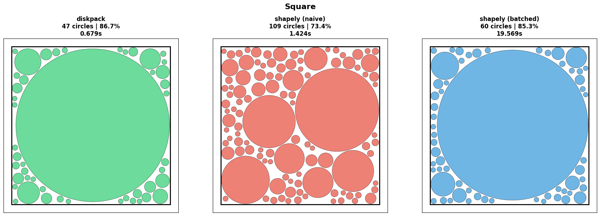

# diskpack

State-of-the-art circle packing for arbitrary polygons.

 


```bash
pip install diskpack
```

## Quick Start

```python
from diskpack import CirclePacker, PackingConfig
import numpy as np

# Define a polygon (list of vertices)
square = [(0, 0), (100, 0), (100, 100), (0, 100)]

# Pack circles
packer = CirclePacker([np.array(square)])
circles = packer.pack()

# Each circle is (x, y, radius)
for x, y, r in circles:
    print(f"Circle at ({x:.1f}, {y:.1f}) with radius {r:.1f}")
```

## Choosing the Right Algorithm

diskpack offers multiple packing strategies optimized for different use cases:

| Shape Type | Best Algorithm | Config |
|------------|----------------|--------|
| Simple convex (square, rectangle) | Random sampling | `PackingConfig()` |
| Complex/concave (star, L-shape, letters) | Hybrid | `PackingConfig(use_hybrid_packing=True)` |
| Fixed radius, need speed | Hex grid | `PackingConfig(fixed_radius=5.0)` |
| Fixed radius, need density | Hybrid | `PackingConfig(fixed_radius=5.0, use_hybrid_packing=True)` |
| Artistic/organic look | Random | `PackingConfig(use_hex_grid=False)` |

### Simple Convex Shapes

For squares, rectangles, and other simple convex polygons, the default random sampling achieves the best density:

```python
config = PackingConfig(
    padding=0.5,
    min_radius=1.0,
)
packer = CirclePacker([np.array(square)], config)
circles = packer.pack()  # ~86% density
```

### Complex/Concave Shapes

For stars, L-shapes, letters, and other complex polygons, hybrid mode fills corners better:

```python
star = [
    (50, 0), (61, 35), (98, 35), (68, 57), (79, 91),
    (50, 70), (21, 91), (32, 57), (2, 35), (39, 35)
]

config = PackingConfig(
    use_hybrid_packing=True,
    verbose=True,  # See progress
)
packer = CirclePacker([np.array(star)], config)
circles = packer.pack()  # ~69% density (vs ~64% for random)
```

### Fixed Radius Packing

When all circles must have the same radius:

```python
# Fastest (hex grid pattern)
config = PackingConfig(fixed_radius=3.0)

# Densest (fills corners)
config = PackingConfig(fixed_radius=3.0, use_hybrid_packing=True)

# Organic look (random placement)
config = PackingConfig(fixed_radius=3.0, use_hex_grid=False)
```

## Tuning Hybrid Mode

Hybrid mode works in three phases:

1. **Phase 1 (Large)**: Place circles ≥ 50% of max possible radius
2. **Phase 2 (Medium)**: Place circles ≥ 25% of max possible radius  
3. **Phase 3 (Small)**: Fill remaining gaps with random sampling

You can tune the thresholds:

```python
# For complex shapes with tight corners (default)
config = PackingConfig(
    use_hybrid_packing=True,
    hybrid_large_threshold=0.5,   # Phase 1: >= 50% of max
    hybrid_medium_threshold=0.25, # Phase 2: >= 25% of max
)

# For simpler shapes (more circles in Phases 1-2)
config = PackingConfig(
    use_hybrid_packing=True,
    hybrid_large_threshold=0.3,   # Phase 1: >= 30% of max
    hybrid_medium_threshold=0.1,  # Phase 2: >= 10% of max
)
```

## Performance Tuning

```python
config = PackingConfig(
    # Stop after N consecutive failed attempts (higher = more circles, slower)
    max_failed_attempts=200,
    
    # Points sampled per iteration (higher = better placements, more memory)
    sample_batch_size=50,
    
    # Minimum gap between circles
    padding=1.5,
    
    # Smallest circle to place
    min_radius=1.0,
)
```

## API Reference

### CirclePacker

```python
CirclePacker(polygons: List[np.ndarray], config: PackingConfig = None)
```

- `polygons`: List of polygon vertices. Each polygon is an Nx2 numpy array.
- `config`: Optional configuration. Uses defaults if not provided.

**Methods:**

- `pack() -> List[Tuple[float, float, float]]`: Pack circles and return as list
- `generate() -> Iterator[Tuple[float, float, float]]`: Generate circles lazily

### PackingConfig

See the docstring for full parameter documentation:

```python
from diskpack import PackingConfig
help(PackingConfig)
```

## Benchmark Results

Tested on 100×100 unit shapes:

| Shape | Algorithm | Time | Circles | Density |
|-------|-----------|------|---------|---------|
| Square | Random | 0.31s | 49 | **86.4%** |
| Square | Hybrid | **0.15s** | 55 | 85.8% |
| L-Shape | Random | 0.68s | 50 | 76.9% |
| L-Shape | Hybrid | **0.30s** | 36 | **79.3%** |
| Star | Random | 0.32s | 39 | 64.4% |
| Star | Hybrid | **0.25s** | 27 | **68.8%** |

Fixed radius (r=3.0) on Star shape:

| Algorithm | Time | Circles | Density |
|-----------|------|---------|---------|
| Hex Grid | **0.007s** | 40 | 40.0% |
| Hybrid | 0.08s | **51** | **51.0%** |

## Comparison with Shapely

diskpack achieves higher density and faster packing compared to the Python Shapely library. Where Shapely creates Python objects for each point-in-polygon and distance check, diskpack uses vectorized NumPy operations with precomputed edge geometry and batched candidate evaluation — sampling many points per iteration and greedily placing the largest valid circle. A grid-based spatial index keeps collision detection O(1) as circle count grows. The batched Shapely method can approach similar density by also picking the best of many candidates, but at ~30x the runtime due to per-point object overhead.



| Method | Circles | Density | Time |
|--------|---------|---------|------|
| **diskpack** | 47 | **86.7%** | **0.679s** |
| shapely (naive) | 109 | 73.4% | 1.424s |
| shapely (batched) | 60 | 85.3% | 19.569s |

See [`demo/diskpack_comparisons.ipynb`](demo/diskpack_comparisons.ipynb) for the full benchmark notebook.

## License

MIT
